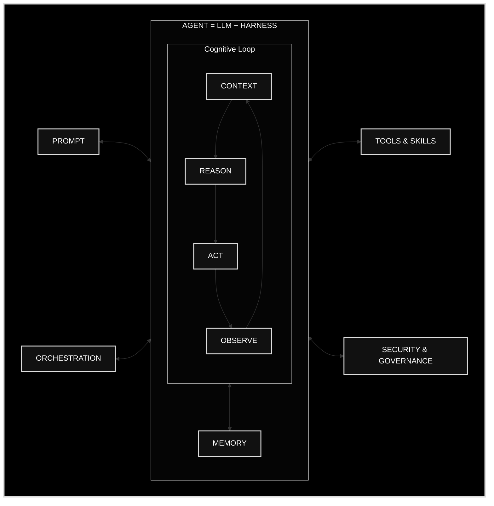

# NVIDIA's Agent Infrastructure Bet (GTC Taipei 2026)

Jensen Huang's GTC Taipei 2026 keynote, unveiling NVIDIA's platforms across AI-factory infrastructure, agentic AI, physical AI/robotics, and AI-native personal computing — branded partly around the phrase **"CPU for Agents."**

That phrase is doing more than branding: it proposes a re-definition of the PC itself, from *Personal Computer* to *Personal Agent* — the machine on your desk reframed as the thing that runs your agent rather than the thing you operate directly.

The keynote's agent-architecture diagram restates the same "Agent = LLM + Harness" framing used throughout this wiki's harness pages: a cognitive loop (context → reason → act → observe, feeding back into itself) wired to memory, tools/skills, and security/governance, sitting between prompt and orchestration.

## Cross-reference

NVIDIA's diagram is a near-exact restatement of the "Agent = Model + Harness" framing already established in [[Agent Harnesses]], [[Harness Engineering - Guides, Sensors, and Regulation Categories]], and [[LangChain's Middleware Model for Custom Agent Harnesses]] — worth noting how consistently that mental model now shows up across labs, frameworks, and hardware vendors alike.

The long arc behind this keynote — Huang's 2006 CUDA bet, the 70% stock collapse that followed, and its vindication by AlexNet in 2012 — is told in [[AlexNet and the Three Nonconformists Who Built the Deep Learning Boom]] and collected with the rest of that history in [[The Origins of Generative AI]].

[[The Harness Is the Product]] treats this keynote as the silicon vantage point — convergence on the same decomposition from the opposite end of the stack.

## Sources
- [NVIDIA GTC Taipei 2026 Keynote  Full Replay](<../../source/NVIDIA GTC Taipei 2026 Keynote  Full Replay.md>)

#ai-companies #nvidia #harness-engineering
